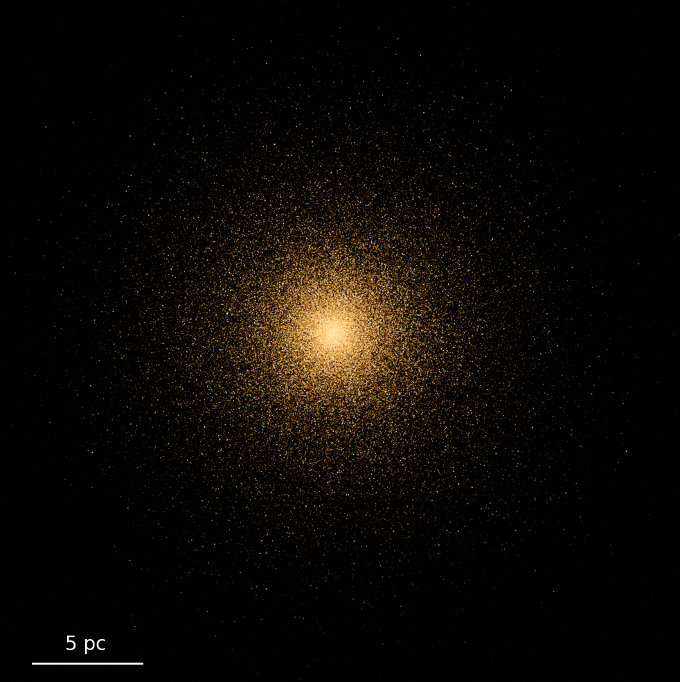
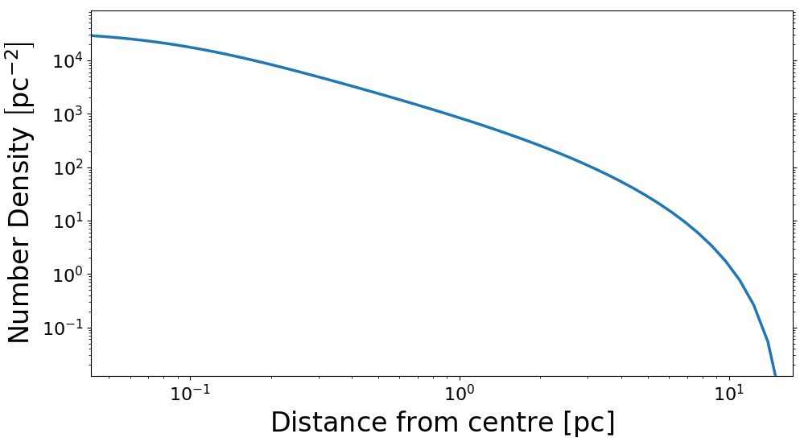

.. GCfit documentation master file, created by
   sphinx-quickstart on Wed Nov 10 19:36:09 2021.
   You can adapt this file completely to your liking, but it should at least
   contain the root `toctree` directive.

Welcome to GCfit's documentation!
=================================

:Release: |release|
:Date: |today|

GCfit is a Python package enabling the creation and extension of
distribution-function based lowered isothermal
(`LIMEPY <https://github.com/mgieles/limepy>`_) models,
representing globular cluster (GC) systems, as well as the generalized
fitting of these models to various observational GC data products, via a
parallelized bayesian sampling suite.

Quick Start
-----------

Globular cluster models are created using the
:class:`gcfit.Model<gcfit.core.data.Model>` class. The minimum
requirements are to supply a central potential (``W0``), a total mass (``M``), a
half-mass radius (``rh``), an age (``age``) and a metallicity (``FeH``).

.. code-block:: python

   >>> import gcfit
   >>> model = gcfit.Model(6., 5e5, 3., age=12., FeH=-1.)

See :class:`Model<gcfit.core.data.Model>` for a list of accessible model attributes.

Certain characteristics, like age and metallicity, can be taken from real
clusters using the corresponding observations data file:

.. code-block:: python

   >>> obs = gcfit.Observations('NGC104')
   >>> model = gcfit.Model(6., 5e5, 3., observations=obs)

Single mass models are created in the same fashion, using the
``SingleMassModel`` class:

.. code-block:: python

   >>> model = gcfit.SingleMassModel(6., 5e5, 3.)

Specific classes of models, such as King (1966) models, are created using
the relevant constructors:

.. code-block:: python

   >>> model = gcfit.Model.king(6., 5e5, 3., age=12., FeH=-1.)

Easy visualizations of the models are done through the :ref:`analysis` module:

.. code-block:: python

   >>> mviz = model.get_visualizer()
   >>> mviz.plot_number_density(label_position='left')

Contents
--------

For more details on the models, fitting procedures, and the rest of the package,
see the proceeding pages:

.. toctree::
   :maxdepth: 2

   Installation <installation>
   Models <models>
   Fitting <fitting>
   Usage and Examples <usage/usage>
   API <ref/api>
   References <citations>
