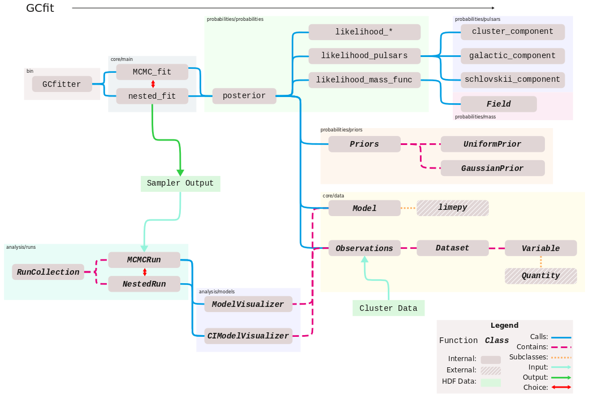

===
API
===

This page details the methods and classes provided by the ``GCfit`` module.

.. TODO this imaage needs to be updated since nested classes were split off

(^slightly out of date)

.. toctree::
   :maxdepth: 2
   :caption: Contents:

   core
   probabilities
   analysis
   util
